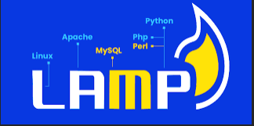

# Práctica_6.-Instalación de Wordpress en Instancia AWS.

### Aquí hemos contado con la creación de una pila lamp, la cual contiene linux (S.O), apache, mysql, php:

Donde, como base de la pila lamp vamos a instalar wordpress, desde la raiz hasta en un directorio propio.
#

### Con esto, buscamos hacer un despligue de aplicaciones.

# Muestra todos los comandos que se han ejeutado.
```
set -ex
```
<p>Se interrumpe el script si hay algún fallo a lo largo de la ejecución del código</p>

# Actualización de repositorios
```
 sudo apt update
```
# Actualización de paquetes
# sudo apt upgrade  

# Instalamos el servidor Web apache
```
apt install apache2 -y
```
### Con esto instalamos el servidor web apache2.

### Estructura de directorios del servicio apache2.

```
 1. Directorios
  1.1 conf-available --> donde se aplican los hosts virtuales.
  1.2 conf-enabled --> donde se encuentran enlaces simbolicos a los archivos de configuracion           
  de conf-available.
  1.3 mods-available --> para añadir funcionalidades al servidor.
  1.4 mods-enabled --> enlaces simbolicos a esas funcionalidades.
  1.5 sites-available --> archivos de configuración de hosts virtuales.
  1.6 sites-enabled --> enlaces simbolicos a sites-available.
 2. Ficheros
  2.1 apache2.conf --> Archivo de configuración principal.
  2.3 envvars --> Define las variables de entorno, que se usan en el archivo principal.
  2.3 magic --> Para determinar el tipo de contenido, por defecto es MIME.
  2.4 ports.conf --> archivo donde se encuentran los puertos de escucha de apache.
```

### En /etc/apache2 se almacenan los archivos y directorios de apache2.

## Contenido del fichero /conf/000-default.conf.
Este archivo contiene la configuración del host virtual el cual debe contener las siguientes directivas para que funcione la aplicación web.

En la ruta del repositorio ``/conf/000-default.conf``, encontramos la configuración que se emplea para este despliegue.

```python
ServerSignature Off
ServerTokens Prod
<VirtualHost *:80>
    #ServerAdmin webmaster@localhost
    DocumentRoot /var/www/html
    DirectoryIndex index.php index.html 
    
    <Directory "/var/www/html/">
        AllowOverride All
    </Directory>

    ErrorLog ${APACHE_LOG_DIR}/error.log
    CustomLog ${APACHE_LOG_DIR}/access.log combined
</VirtualHost>
```
Aquí podemos comprobar lo que contiene el fichero de configuración del ``VirtualHost``, donde todas las conexiones pasaran por el puerto 80, el ``DocumentRoot``, donde mostrará el contenido será desde ``/var/www/html`` y podemos ver los archivos de error y acceso para comprobar errores y ver quien ha accedido, Tambien, tenemos la directiva ``Directory index`` la cual establece una prioridad en el orden que se establezca.

Podemos comprobar que hemos añadido ``directory`` el cual almacena las directivas asignadas al virtualhost, mas las que se encuentran en el archivo principal de apache. 

La ruta donde se ejecuta el contenido que vamos a mostrar por internet y la directiva ``AllowOverride All`` mas adelante se explica el porque esto está aquí, como información puedo ofrecer que tiene que ver con el archivo ``.htaccess``.

### También se hace uso de las siguientes directivas 
``ServerSignature OFF `` --> Esto es por si nos interesa incorporar la versión de apache, en páginas de error e indice de directorios, lo dejamos en OFF por seguridad. Se debe aplicar a todo el servidor.

``ServerTokens Prod `` --> Esta se puede aplicar a un único servidor virtual. Aquí se muestran información sobre las cabeceras, es decir, respuestas que se mandan al cliente, es conveniente tenerlo quitado.

# Instalar mysql server
```
apt install mysql-server -y
```

### Con esto instalamos mysql-server.

# Instalar php
```
apt install php libapache2-mod-php php-mysql -y
```
### Instalamos php junto con unos modulos necesarios.
<------------------------------------------------------>
### ``libapache2-mod-php`` --> para mostrar paginas web desde un servidor web apache y ``php-mysql``, nos permite conectar una base de datos de MySQL desde PHP.

# Copiar el archivo de configuracion de apache.
```
cp ../conf/000-default.conf /etc/apache2/sites-available
```
### En este caso, no haría falta emplear el comando ``a2ensite``, ya que se habilita por defecto debido a que apache2 toma por defecto la configuración de ese archivo para desplegar las opciones que hemos hecho en la web.

### Este script posee un archivo de configuración en la carpeta ``conf `` por el cual configura el host virtual que muestra el contenido de la aplicación web.

```
ServerSignature Off
ServerTokens Prod
<VirtualHost *:80>
    #ServerAdmin webmaster@localhost
    DocumentRoot /var/www/html
    DirectoryIndex index.php index.html
    
    <Directory "/var/www/html/">
        AllowOverride All
    </Directory>

    ErrorLog ${APACHE_LOG_DIR}/error.log
    CustomLog ${APACHE_LOG_DIR}/access.log combined
</VirtualHost>
```

# Reiniciamos el servicio apache
```
systemctl restart apache2
```
### Reiniciamos apache para que obtenga los cambios.

# Copiamos el arhivo de prueba de php
### La finalidad de esto va a ser que muestre el contenido de la página index.php la cual se inserta en la carpeta html, con objetivo de que muestre el contenido de esa página, por defecto, si vemos el archivo de configuración de 000-default.conf veremos que:
 <p> DocumentRoot ``/var/www/html`` --> Toma como raiz, los archivos en html.</p>
 <p> ``DirectoryIndex`` --> index.php index.html --> Muestra en orden los archivo situados.</p>    

```
cp ../php/index.php /var/www/html
```
### Sabiendo lo anterior copiamos el archivo index.php a ``/var/www/html``.

# Modificamos el propietario y el grupo del directo /var/www/html
```
chown -R www-data:www-data /var/www/html
```
### Lo que estamos haciendo es que el usuario de apache tenga permisos de propietario sobre, el directorio html con objetivo de que pueda desplegar el **sitio web**.

# Conexiones
<p>Ahora podriamos conectarnos a traves de nuestro navegador a nuestra pagina index.php</p>

```
En el navegador --> http://nuestraipservidor/index.php, y debería salirnos.
```
# 2 Instalación de certbot y sitio web con certificado transmitido por autoridad certificadora.

<p>Pero, ¿Que es una autoridad certificadora? Nos permite que el acceso a nuestro contenido web se cifre y sea seguro, hoy dia no se permite el uso de paginas http sin el protocolo ssl/tls, con el que cifra los datos durante las peticiones.</p>

### Muestra todos los comandos que se han ejecutado.
<p>-- Aparte de que interrumpe el script en caso de errores.</p>

```
set -ex
```
# 1 Actualización de repositorios

```
 apt update
```
<p>Actualizamos los repositorios para que el software se instale correctamente y no de pié a errores durante la ejecución del script.</p>

# 2 Importamos el archivo de variables .env

```
source .env
```

<p>El cual las variables que nos interesan de este archivo son las siguientes:</p>

```
# Variables para el certificado.
CERTIFICATE_EMAIL=demo@demo.es
CERTIFICATE_DOMAIN=practicahttps10.ddns.net
```

<p>Estas son las variables que requerimos para la creación del certificado el cual a traves de una autoridad certificadora de confianza, nos va a secuerizar el contenido, mediante https, cogiendo el dominio que he creado con noip y asignando a ese dominio la ip de la máquina con la que se pretende realizar el despliegue.</p>

Esto se realizará automaticamente con certbot, ya que junto con letsencrypt se encargará el de establecer el certificado seguro.

### 3 Borramos certbot para instalarlo despues, en caso de que se encuentre, lo borramos de apt para instalarlo con snap.
#
```
apt remove certbot
```
Con esto desinstalamos certbot por si se haya en el sistema.

#Instalación de snap y actualizacion del mismo.
```
snap install core
snap refresh core
```
Instalamos y ejecutamos el gestor de paquetes snap, el cual lo necesitamos para instalar certbot.

# 4 Instalamos la aplicacion certbot

```
snap install --classic certbot
```

### Donde --classic hace que dicha aplicación se instale, con una serie de permisos para que forme parte de un entorno seguro y aislado teniendo acceso a recursos del sistema que a lo mejor no podría tener.

# 5 Creamos un alias para la aplicacion certbot

```
ln -sf /snap/bin/certbot /usr/bin/certbot
```

### Creamos un enlace simbólico donde:

```python
ln --> Para crear un enlace en el sistema.
-s --> El tipo de enlace que crea es simbólico.
-f --> Para que lo cree por la fuerza.
```
Tras eso, hemos creado un enlace simbolico en ``/usr/bin`` para que se ejecute una vez lo llamamos, es decir para que se ejecute, es necesario ya que necesitamos que se ejecute para recibir ese certificado de confianza.

# 6 Obtener el certificado.

```
certbot --apache -m $CERTIFICATE_EMAIL --agree-tos --no-eff-email -d $CERTIFICATE_DOMAIN --non-interactive
```

Nosotros si solo insertasemos ``certbot --apache``, lo ejecutaría pero, interrumpería la automatización del script, ya que buscamos que se realice automáticamente, esto se debe a que aparecen asistentes donde hay que insertar una serie de datos.

```python
--apache: Esto significa que da el certificado para apache.
-m: Establecemos la direccion de correo la cual la contiene la variable $CERTIFICATE_EMAIL del archivo .env, se puede cambiar por otra.
--agree-tos: Con esto aceptamos terminos de uso.
--no-eff-email: Con esto no compartimos nuestro email con la EFF.
-d: El dominio que contiene la variable: $CERTIFICATE_DOMAIN.
--non-interactive: Para que declarar que se hace de forma no interactiva. 
```

# 3.Alternativas de instalación
<p>Se puede instalar de dos formas, en el directorio raiz, o en un directorio propio de wordpress, la variación entre los dos es mínima cuando se instala.</p>

# 3.1- Instalación de wordpress en la ``raiz``.
```
#!/bin/bash
```
<p>Elegimos el interprete de comandos por defecto.</p>

# 3.2 Muestra todos los comandos que se han ejecutado.
```
set -ex
```
<p>Interrumpimos el script cuando haya un problema.</p>

# 3.3 Actualización de repositorios
```
 sudo apt update
```
<p>Actualizamos los repositorios, para evitar problemas a la hora de instalar software.</p> 

# 3.4 Incluimos las variables del archivo .env.
```
source .env
```
Dentro de este archivo se encuentran las variables siguientes: 
```
# Configuramos variables
#-----------------------------#
WORDPRESS_DB_NAME=wordpress
WORDPRESS_DB_USER=wp_user
WORDPRESS_DB_PASSWORD=wp_pass
IP_CLIENTE_MYSQL=localhost
WORDPRESS_DB_HOST=localhost
```

<p>Estas variables se necesitan para la creación de la base de datos de wordpress, la creación del usuario, y creación del acceso a dicha base de datos, se pueden modificar con el nombre que se deseen.</p>

# 3.5 Eliminar el archivo de codigo fuente descargado previamente.
```
rm -rf /tmp/latest.zip*
```
<p>Este comando elimina el codigo fuente de wordpress antes de descargarlo para que no se guarden muchas veces el mismo fichero.</p>

# 3.6 Descargamos el codigo fuente de wordpress
```
wget http://wordpress.org/latest.zip -P /tmp
```
<p>Con esto lo que vamos a hacer es obtener la última version de wordpress comprimida en zip y con el comando -P lo mandamos al directorio /tmp.</p>

# 3.7 Instalar el comando unzip.
```
apt install unzip -y
```
Instalamos unzip para descomprimirlo, con la opción -y para que lo haga automáticamente.
# 3.8 Descomprimimos el archivo latest.zip
```
unzip -u /tmp/latest.zip -d /tmp/
```
Lo descomprimimos en el destino directorio de destino /tmp/.

# 3.9 Eliminamos instalaciones previas de wordpress en /var/www/html
```
rm -rf /var/www/html/*
```
Tras eso eliminamos las instalaciones previas de wordpress, ya que posteriormente se manda el contenido de wordpress a /var/www/html, la eliminación que realizamos es, de forma recursiva y por la fuerza.

# 3.10 Movemos el contenido de /tmp/wordpress a /var/www/html
```
mv -f /tmp/wordpress/* /var/www/html
```
Tras eso, aquí movemos por la fuerza el contenido de wordpress a /var/www/html para que apache pueda mostrarlo.

# Mover el contenido de /tmp/wordpress a /var/www/html.
```
mv -f /tmp/wordpress /var/www/html
```
Tras eso, aquí movemos por la fuerza el contenido de wordpress a /var/www/html para que apache pueda mostrarlo.
# 3.12 Creamos la base de la bbase de datos y el usuario de la base de datos.
```
mysql -u root <<< "DROP DATABASE IF EXISTS $WORDPRESS_DB_NAME"
mysql -u root <<< "CREATE DATABASE $WORDPRESS_DB_NAME"
mysql -u root <<< "DROP USER IF EXISTS $WORDPRESS_DB_USER@$IP_CLIENTE_MYSQL"
mysql -u root <<< "CREATE USER $WORDPRESS_DB_USER@$IP_CLIENTE_MYSQL IDENTIFIED BY '$WORDPRESS_DB_PASSWORD'"
mysql -u root <<< "GRANT ALL PRIVILEGES ON $WORDPRESS_DB_NAME.* TO $WORDPRESS_DB_USER@$IP_CLIENTE_MYSQL"
```
Con las variables que hemos designado en el archivo .env estas variables que se encuentran definidas en ese archivo y se llaman a traves source .env, contienen datos con los que se van a rellenar automaticamente al insertar esas instrucciones al usuario root de mysql para que los cree el mismo en ese proceso, desde la base de datos hasta el usuario en cuestión.

# 3.13 Creamos nuestro archivo de configuración de wordpress
```
cp /var/www/html/wp-config-sample.php /var/www/html/wp-config.php
```
Creamos este fichero, dicho fichero es de los mas importantes en wordpress, permitiendo la configuración básica de wordpress y el acceso a las bases de datos, además de que se encuentran ficheros de registro, basados en errores.

# 3.14 Configuramos las variables del archivo de configuracion de wordpress
```
sed -i "s/database_name_here/$WORDPRESS_DB_NAME/" /var/www/html/wp-config.php
sed -i "s/username_here/$WORDPRESS_DB_USER/" /var/www/html/wp-config.php
sed -i "s/password_here/$WORDPRESS_DB_PASSWORD/" /var/www/html/wp-config.php
sed -i "s/localhost/$WORDPRESS_DB_HOST/" /var/www/html/wp-config.php
```
Empleamos el ``comando sed`` bajo la orden ``-i`` y ``"s"`` precedido de ``"/"`` con la intención de que con el ``-i`` se inserten en vez de que los muestre unicamente por pantalla y que con la ``s`` realice un ``"busca y reemplazo"`` basandose en que a la *izquierda se encuentra lo que se quiere sustituir y lo que se va a poner*.

# 3.15 Cambiamos el propietario para wordpress.
```
chown -R www-data:www-data /var/www/html/
```
Se cambian los permisos para que el usuario www-data de apache pueda ejecutar el contenido de la ruta /var/www/html/
# 3.16 Habilitamos el modulo mod_rewrite de apache.
```
a2enmod rewrite
```
Esto hace que el acceso a los recursos sea mejor accesible y mas fácil de recordar, esto es ayudado por el fichero htaccess junto con la directiva AllowOverride All.

# 3.17 Copiar a /var/www/html el directorio htaccess
```
cp ../conf/.htaccess /var/www/html
```
Copiamos el fichero htaccess a la ruta /var/www/html para que lo ejecute apache cuando lo requiera.
# 3.18 Reiniciamos el servicio.
```
systemctl restart apache2
```
Reiniciamos el servicio, para que se aplique el modulo rewrite.
# 3.19 Cambiamos el propietario para wordpress.
```
chown -R www-data:www-data /var/www/html/
```
Cambiamos el propietario para que pueda acceder a los recursos de /var/www/html
